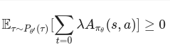
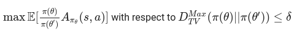

[](https://makeapullrequest.com)

# TRPO-PyTorch
According to the Policy Iteration scheme, if view Policy Gradient as a Policy Iteration procedure then if the new policy π′ with parameters θ′ is going to be better than the current policy π with parameters θ then J(θ′) ≥ J(θ′).  

This implies that:

<p align="center">
  
</p>  

But the distributional mismatch between A<sub>π<sub>θ</sub></sub> and P<sub>θ′</sub>(τ) should be corrected.  

Conservative Policy Iteration proposed the following objective and constriant to address the aforementioned issue:

<p align="center">
  
</p>  

where D<sub>TV</sub> <sup>Max</sup> is the maximum total deviation between π(θ) and π′(θ′).  

In order to make this algorithm practical for largesacle problems such as Neural Networks where the scale of the parameter space is huge, Trust Region Policy Optimization (TRPO) proved that instead of D<sub>TV</sub> <sup>Max</sup> we can use KL Divergence (D<sub>KL</sub>) metric and further more, in order to satisfy the constraint during optimization phase, it introduced the second-order approximation of the D<sub>KL</sub> which is the Fisher Information Matrix. TRPO consequently tried to find the direction (s) and the step size (β) that the new parameters θ′ that should be lied in (`θ′ = θ + βs`) by using the resulting Fisher Information Matrix and the Conjugate Gradient algorithm.  

As I searched through various repositories relating to TRPO, the only one that used TRPO on the Atari benchmark was the [baselines](https://github.com/openai/baselines) by [@OpenAI](https://github.com/openai) and that code took advantage of TensorFlow therefore, I found it movitating to bring up this repo to solve some Atari games but by using PyTorch this time. So:  
<p align="center">
  <b>This repository is a PyTorch implemntation of Trust Region Optimization paper on Atari benchmark</b>. 
</p>  

## Demo
Beam Rider | Ms Pacman
:------------:|:---------------:
|

## Results
> - Environment: MsPacmanNoFrameskip-v4
> - Number of workers: 8
> - Hyperparameters are borrowed from [here](https://github.com/openai/baselines/blob/master/baselines/trpo_mpi/defaults.py) except for the entropy coefficient that was set 0.01 based on personal preference.

<p align="center">
  
</p>  
<p align="center">
  
</p>  
<p align="center">
  
</p>  
<p align="center">
  
</p>  

## Dependencies
- gym == 0.24.1
- numpy == 1.23.1
- opencv_python == 4.6.0.66
- psutil == 5.9.1
- torch == 1.12.0
- tqdm == 4.64.0
- wandb == 0.12.21

## Usage
```bash
python main.py --interval=500 --train_from_scratch --online_wandb --env_name="SeaquestNoFrameskip-v4"
```
```bash
usage: main.py [-h] [--env_name ENV_NAME] [--num_worker NUM_WORKER]
               [--total_iterations TOTAL_ITERATIONS] [--interval INTERVAL]
               [--online_wandb] [--do_test] [--render] [--train_from_scratch]
               [--seed SEED]

Variable parameters based on the configuration of the machine or user's choice

options:
  -h, --help            show this help message and exit
  --env_name ENV_NAME   Name of the environment.
  --num_worker NUM_WORKER
                        Number of parallel workers. (-1) to use as many as cpu
                        cores.
  --total_iterations TOTAL_ITERATIONS
                        The total number of iterations.
  --interval INTERVAL   The interval specifies how often different parameters
                        should be saved and printed, counted by iterations.
  --online_wandb        Run wandb in online mode.
  --do_test             The flag determines whether to train the agent or play
                        with it.
  --train_from_scratch  The flag determines whether to train from scratch or
                        continue the last try.
  --seed SEED           The random seed.
```
###  Considerations
- You can put your _wandb API key_ in a file named `api_key.wandb` at the root directory of the project and the code will automatically read the key and as a result, there will be no need to insert your wandb credentials each time:
```python
def init_wandb(online_mode=False):
    if os.path.exists("api_key.wandb"):
        with open("api_key.wandb", 'r') as f:
            os.environ["WANDB_API_KEY"] = f.read()
            if not online_mode:
                os.environ["WANDB_MODE"] = "offline"
    else:
        if not online_mode:
            os.environ["WANDB_MODE"] = "offline"
        key = input("Please enter your wandb api key then press enter (just hit the enter if you don't have any):")
        wandb.login(key=key)
```
- At the time of testing, the code by default uses the weights of the latest run available in _`weights`_ folder because each subdirectory is named by the time and the date (e.g. 2022-07-13-06-51-32 indicating 7/13/2022, 6:51:32) that the code was executed correspondingly so, please bear in mind to put your desired `*.pth` file in the appropriate subdirectory inside the _`weights`_ directory! 👇
> common/logger.py:
```python
def load_weights(self):
	model_dir = glob.glob("weights/*")
	model_dir.sort()
	self.log_dir = model_dir[-1].split(os.sep)[-1] # -1 means the latest run!
	checkpoint = torch.load("weights/" + self.log_dir + "/params.pth")

	self.brain.model.load_state_dict(checkpoint["model_state_dict"])
	self.brain.value_optimizer.load_state_dict(checkpoint["value_optimizer_state_dict"])

	self.running_last_10_r = checkpoint["running_last_10_r"]
	self.running_training_logs = np.asarray(checkpoint["running_training_logs"])
	self.running_reward = checkpoint["running_reward"]

	if not self.config["do_test"] and not self.config["train_from_scratch"]:
		wandb.init(project="TRPO",  # noqa
		config=self.config,
		job_type="train",
		name=self.log_dir
		)
	return checkpoint["iteration"], checkpoint["episode"]
```
- Although the random seed of all random operations is set with the `seed` flag but still the results of different runs are not reproducible! The reason behind this behavior stems from the randomized algorithms that PyTorch tends to utilize in its **CUDA** computations to exploit parallelism on GPUs and speeding up the code. Therefore, if you want to end up with reproducible results you should run your program on your CPU device.

### Hardware Requirements
- Runs with 8 parallel workers were carried out on [paperspace.com](https://www.paperspace.com/) [Free-GPU, 8 Cores, 30 GB RAM]. I genuinely express my deep appreciation and gratitude toward their great effort in providing such a powerful infrustructure with the inclusion of a practical **FREE of Charge** plan. 

## References
1. [_Trust Region Policy Optimization_, Schulman, et al., 2015](https://arxiv.org/abs/1502.05477)
2. [_Scalable trust-region method for deep reinforcement learning using Kronecker-factored approximation_, Wu et al., 2017](https://arxiv.org/abs/1708.05144)
3. [_Fisher Information and Policy Gradient Methods_, Stratos](https://karlstratos.com/notes/policy_gradient.pdf)

## Acknowledgement
These repositories were chosen as samples of how to turn the TRPO idea into practical code, big thanks to them :
1. [modular_rl](https://github.com/joschu/modular_rl) by [@joschu](https://github.com/joschu)
2. [pytorch-trpo](https://github.com/ikostrikov/pytorch-trpo) by [@ikostrikov](https://github.com/ikostrikov)
3. [baselines](https://github.com/openai/baselines) by [@OpenAI](https://github.com/openai)